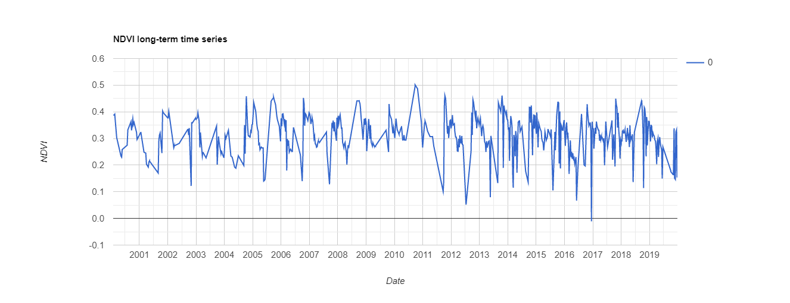

# NDVI Dataset Analysis — Landsat 7 (2000–2019)

## Source

- **File:** `2000-2019-L7.csv`
- **Satellite:** Landsat 7 (L7)
- **Region:** Phaltan / Satara district, Maharashtra
- **Temporal coverage:** February 2000 – December 2019 (~20 years)
- **Total observations:** 719 records (some dates duplicated due to overlapping Landsat path/row coverage)

---

## Data Structure

| Column | Description |
|---|---|
| `system:time_start` | Observation date (e.g., `"Feb 2, 2000"`) |
| `0` | Mean NDVI value for the region of interest |

---

## Key Statistics

| Metric | Value | Date |
|---|---|---|
| Minimum NDVI | -0.011 | Dec 14, 2016 |
| Maximum NDVI | 0.501 | Sep 25, 2010 |
| Typical dry-season range | 0.14 – 0.27 | Apr – Jul |
| Typical peak-season range | 0.38 – 0.50 | Sep – Oct |

---

## Seasonal Pattern

The NDVI time series shows a clear, repeating annual cycle driven by the Southwest Monsoon and the Kharif cropping calendar:

```
Jan–Mar  (Rabi standing crop)   →  NDVI ~0.30 – 0.40  (moderate, declining)
Apr–Jun  (Summer / fallow)      →  NDVI ~0.14 – 0.28  (low, dry fields)
Jul–Aug  (Early Kharif growth)  →  NDVI rising
Sep–Oct  (Peak Kharif)          →  NDVI ~0.38 – 0.50  (annual peak)
Nov–Dec  (Post-harvest / Rabi)  →  NDVI ~0.28 – 0.40  (declining)
```

The strongest annual peak consistently falls in **September–October**, coinciding with the maturation of Kharif crops (sugarcane, soybean) before the post-monsoon harvest.

---

## Year-wise Highlights

| Year | Peak NDVI | Approximate Date | Remark |
|---|---|---|---|
| 2000 | 0.391 | Feb 18 | Moderate rabi season |
| 2001 | 0.403 | Oct 27 | Low mid-season (Aug 0.170) |
| 2002 | 0.401 | Jan 15 | Good rabi; data gap Jul–Sep |
| 2003 | 0.396 | Jan 25 | Weak kharif peak (0.346 Sep) |
| 2004 | 0.458 | Oct 10 | Strong kharif flush |
| 2005 | 0.454 | Sep 27 | Excellent monsoon season |
| 2006 | 0.453 | Oct 16 | Strong kharif, low Sep-30 (0.142) |
| 2007 | 0.393 | Jan 4 | Very low Sep (0.128) — possible drought/cloud |
| 2008 | 0.441 | Sep 3 | Strong monsoon onset |
| 2009 | 0.430 | Oct 24 | Moderate year |
| **2010** | **0.501** | **Sep 25** | **Highest on record — exceptional monsoon** |
| 2011 | 0.460 | Oct 14 | Strong; anomalously low Sep-21 (0.101) |
| 2012 | 0.445 | Oct 9 | Good kharif; outlier Jul-12 (0.052) |
| 2013 | 0.461 | Oct 19 | Among strongest kharif peaks |
| 2014 | 0.424 | Oct 31 | Variable; low Sep-20 (0.137) |
| 2015 | 0.438 | Oct 9 | Strong kharif; El Niño dry summer |
| 2016 | 0.429 | Oct 20 | Negative outlier Dec-14 (-0.011) |
| 2017 | 0.449 | Oct 23 | Good recovery; low early Oct (0.195) |
| 2018 | 0.438 | Sep 24 | Consistent high kharif |
| 2019 | 0.338 | Nov 14 | **Weakest kharif in dataset** — low Oct–Dec values |

---

## Outliers and Anomalies

Several observations record anomalously low NDVI likely caused by **cloud contamination**, **haze**, or **sensor artefacts** rather than actual vegetation loss:

| Date | NDVI | Possible Cause |
|---|---|---|
| Jul 12, 2012 | 0.052 | Cloud shadow / haze during monsoon |
| Sep 21, 2011 | 0.101 | Cloud contamination |
| Jun 5, 2016 | 0.067 | Dense monsoon cloud cover |
| May 21, 2013 | 0.080 | Partial cloud contamination |
| Dec 14, 2016 | -0.011 | Likely cloud/water interference |
| Aug 6, 2015 | 0.105 | Monsoon cloud/haze |

These outliers should be **filtered or interpolated** before using NDVI as a model feature.

---

## Duplicate Observations

Many dates appear **twice** with nearly identical values (e.g., `Sep 13, 2000`: 0.362 / 0.362). This is expected — Landsat 7 has overlapping adjacent path/row footprints, and Google Earth Engine may return both granules. Duplicates can be safely **deduplicated** by averaging or taking the first occurrence.

---

## Data Gaps

Significant gaps in Landsat 7 coverage occur during the **peak monsoon months (Jul–Aug)** in most years due to cloud cover, as well as after the **2003 Scan Line Corrector (SLC) failure** which degraded data quality. Despite this, Sep–Oct observations are generally available annually.

---

## Relationship to Crop Yield

NDVI from this dataset is used as a proxy for **crop canopy development and biomass accumulation**. Key correlations expected with yield:

- **High Sep–Oct NDVI** → good kharif crop establishment → higher sugarcane/soybean yield
- **Low Sep–Oct NDVI** → poor monsoon or pest/disease stress → lower yield
- The 2010 peak (0.501) and 2019 trough likely bracket the best and worst kharif production years in this location

For the crop yield prediction model, the recommended features derived from this series are:

| Feature | Derivation |
|---|---|
| `ndvi_kharif_peak` | Max NDVI in Sep–Oct per year |
| `ndvi_rabi_mean` | Mean NDVI in Dec–Feb per year |
| `ndvi_summer_min` | Min NDVI in Apr–Jun per year |
| `ndvi_annual_mean` | Annual mean NDVI per year |
| `ndvi_growing_season_integral` | Cumulative NDVI Jun–Nov (proxy for total biomass) |

---

## Visualization



The graph shows the full 2000–2019 NDVI time series. The seasonal oscillations are clearly visible, with the 2010 monsoon season standing out as the strongest and 2019 showing a notable decline in kharif-season greenness.
